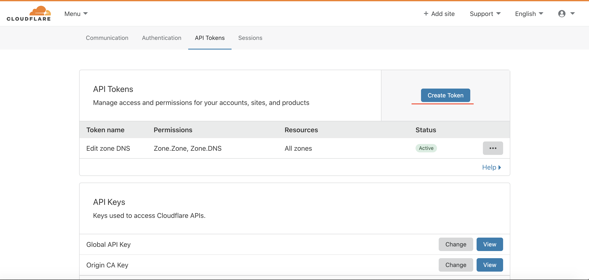
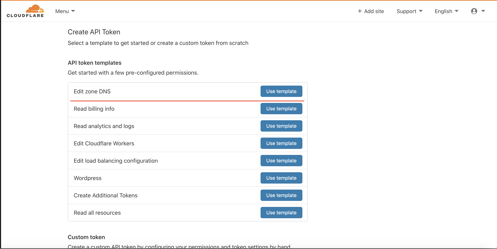
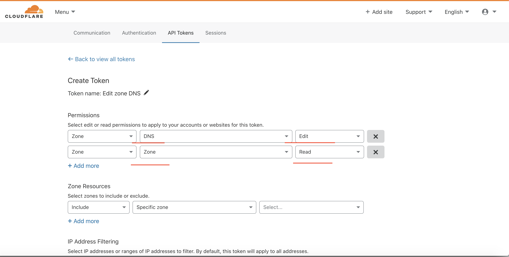
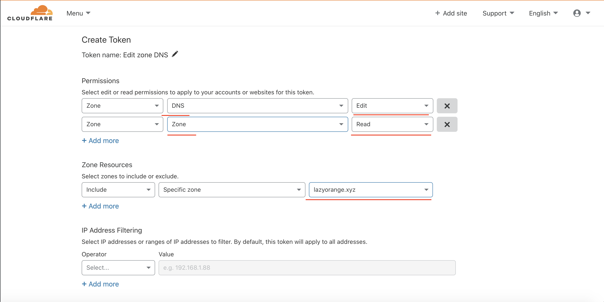
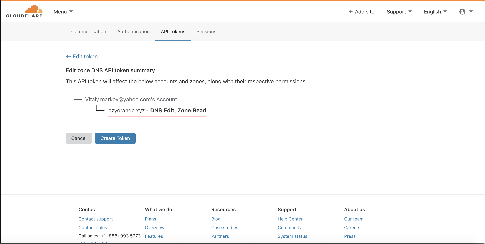

# Setting up ExternalDNS for Services on Cloudflare

This tutorial describes how to setup ExternalDNS for usage within a Kubernetes cluster using Cloudflare DNS.

## Creating a Cloudflare DNS zone

We highly recommend to read this tutorial if you haven't used Cloudflare before:

[Create a Cloudflare account and add a website](https://support.cloudflare.com/hc/en-us/articles/201720164-Step-2-Create-a-Cloudflare-account-and-add-a-website)

## Creating Cloudflare Credentials

Snippet from [Cloudflare - Getting Started](https://api.cloudflare.com/#getting-started-endpoints):

>Cloudflare's API exposes the entire Cloudflare infrastructure via a standardized programmatic interface. Using Cloudflare's API, you can do just about anything you can do on cloudflare.com via the customer dashboard.

>The Cloudflare API is a RESTful API based on HTTPS requests and JSON responses. If you are registered with Cloudflare, you can obtain your API key from the bottom of the "My Account" page, found here: [Go to My account](https://dash.cloudflare.com/profile).

API Token will be preferred for authentication if `CF_API_TOKEN` environment variable is set. 
Otherwise `CF_API_KEY` and `CF_API_EMAIL` should be set to run ExternalDNS with Cloudflare.

When using API Token authentication the token should be granted Zone `Read` and DNS `Edit` privileges.

1. Go to API tokens page and click on button `Create Token`:







2. Export as environment variable or place into terraform tfvars file:
```bash
$ export TF_VAR_cf_token="your_claudflare_token"
```