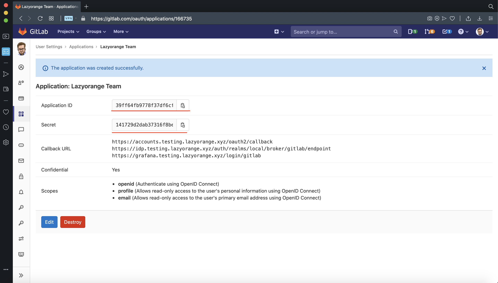

# Gitlab Application Credentials

# Overview

Gitlab Application is used to protect access to your interal services inside your company by using OAuth2 Proxy in front of Grafana, Kibana, Prometheus, etc.

You need to create Gitlab Application by myself if you use Gitlab.com, in future will be provided a way to create application by using Terraform when this [PR](https://github.com/terraform-providers/terraform-provider-gitlab/pull/366) is accepted for self-hosted Gitlab instances, for who use gitlab.com this API is restricted, hope it will be .

Currently you have to manage a list of redirect urls by myself in case if domain urls are changed or new ones are added.

### How to obtain Gitlab Application Credentials?

1. Go to [Gitlab Applications](https://gitlab.com/profile/applications) page.
3. Enter Application's name and a list of redirect URIs like below:
```bash
https://accounts.testing.lazyorange.xyz/oauth2/callback
https://idp.testing.lazyorange.xyz/auth/realms/local/broker/gitlab/endpoint
https://grafana.testing.lazyorange.xyz/login/gitlab
```
You need to replace *testing.lazyorange.xyz* with domain name from [cluster.yaml](https://gitlab.com/lazyorangejs/infra/root.lazyorange.xyz/-/blob/master/testing/cluster.yaml)


2. Click on required scopes `openid`, `profile`, `email` then click on **"Save application"** button to create the application:


3. Copy *client id* and *client secret* values then export as `TF_VAR_idp_creds` environment variable or add to `.env` file:



```bash
$ export TF_VAR_idp_creds='{"provider": "gitlab", "clientID":"YOUR_CLIENT_ID", "clientSecret": "YOUR_CLIENT_SECRET"}'
```