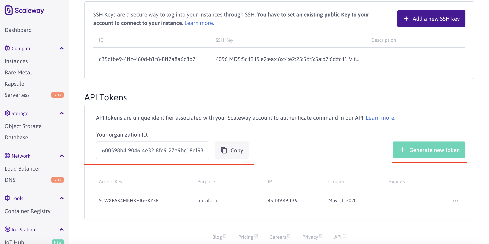
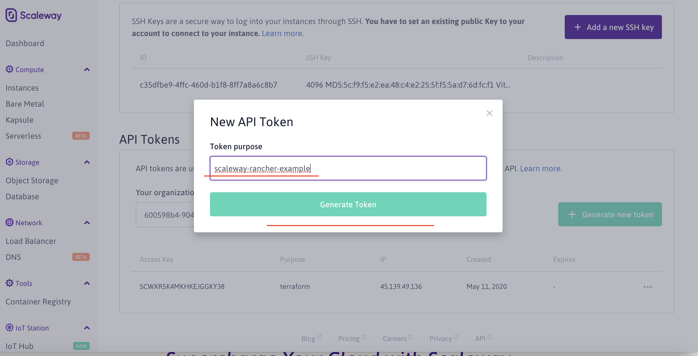
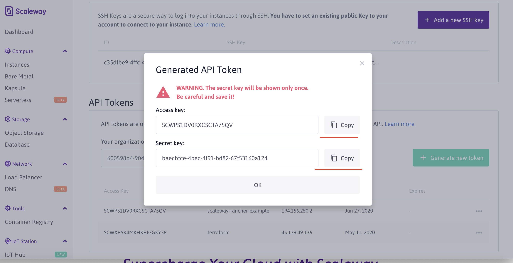

# Scaleway Credentials

### How to obtain scaleway Credentials? 

1. Get you credentials [here](https://console.scaleway.com/account/organization/credentials).
2. Copy Organization ID then set as environment variable.


```bash
$ export SCW_DEFAULT_ORGANIZATION_ID=<your_organization_id>
```
3. Create a token and the set as environment variables.


```bash
$ export SCW_ACCESS_KEY=<your_access_key>
$ export SCW_SECRET_KEY=<your_secret_key>
```
4. Add env variables for default zone and region, for instance:
```bash
$ export SCW_DEFAULT_ZONE=fr-par-1
$ export SCW_DEFAULT_REGION=fr-par
```